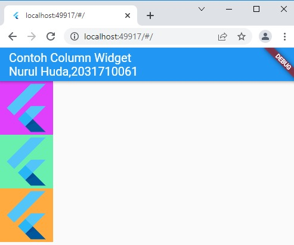

# build_in_widget

NIM : 2031710061
Nama : Nurul Huda
Kelas : MI 2C
Prodi : D3-MI

## Hasil Praktikum

## 1. Text Widget

## 2. Image widget

## 3. Cupirtino

## 4. Button

## 5. Scaffold

## 6. Dialog

## 7. Input dan Selection Widget

## 8. Date and Time Pickers

## 9. Property Child

## 10. Property Alignment

## 11. Property Color

## 12. Property Hight dan Width

## 13. Property Margin

## 14. Property Padding

## 15. Property Transform

## 16. Property Decoration

## 17. Row

## 18. Column

## 19. Stack

## 20. List View

## 21. Grid View

## 22. Praktium UI Sederhana

